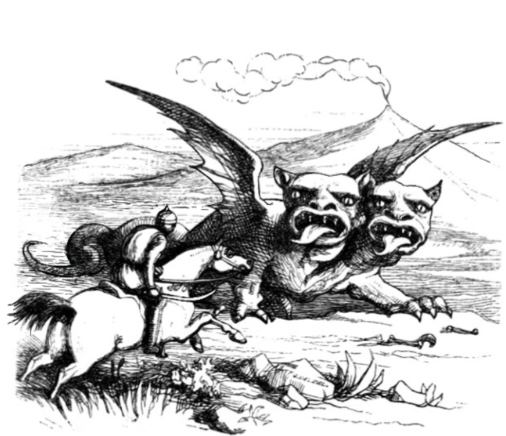
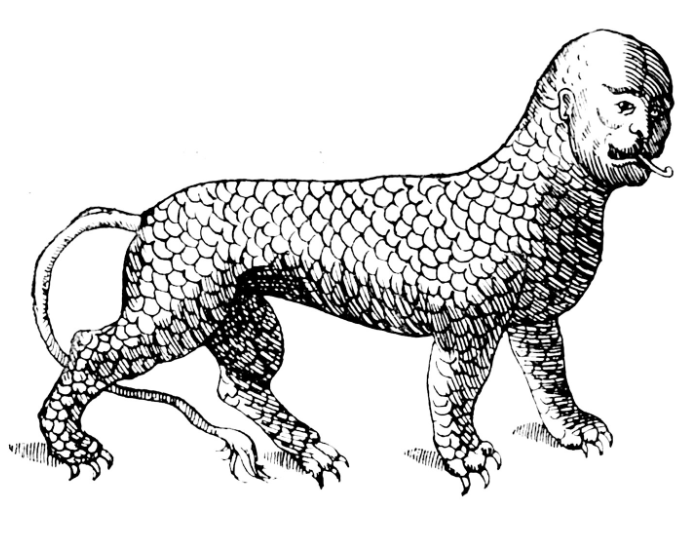

# Виклик Gygax 75: Українське видання
Розпочніть творчу подорож, щоб створити власний сеттинг кампанії за лише п'ять тижнів, надихаючись порадами легендарного Гарі Гігакса з 1975 року, незабаром після випуску D&D.

## Зміст
- [Вступ](Вступ.md)
- [Як користуватися цією книгою](Як%20користуватися%20цією%20книгою.md)
- [Тиждень 1 Концепт](Тиждень%201%20Концепт.md)
- [Тиждень 2 Околиці](Тиждень%202%20Околиці.md)
- [Тиждень 3 Підземелля](Тиждень%203%20Підземелля.md)
- [Тиждень 4 Особливості міста](Тиждень%204%20Особливості%20міста.md)
- [Тиждень 5 Великий світ](Тиждень%205%20Великий%20світ.md)
- [Словами Гарі Гігакса](Словами%20Гарі%20Гігакса.md)

