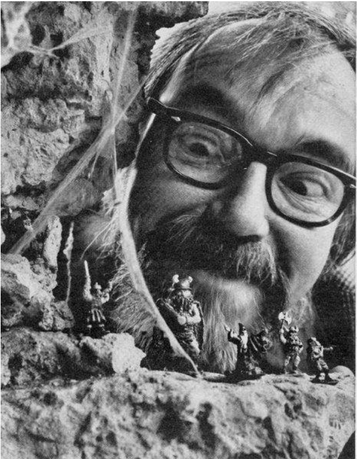

# Словами Гарі Гігакса
## Європа, квітень 1975, стор. 18-20
## ЯК СТВОРИТИ СВОЮ КАМПАНІЮ DUNGEONS & DRAGONS І ПРОВОДИТИ її СІМ ДНІВ НА ТИЖДЕНЬ ДО САМОГО РАНКУ! 

### Частина II із серії публікацій Гері Гігакса (США) 

Припустімо, що ви витратили необхідну кількість доларів на придбання всіх матеріалів, необхідних для проведення кампанії D&D: правил, кубиків, пачок паперу, олівців і т.д. Кілька людей висловили бажання зіграти в гру, тож все, що вам зараз потрібно - це ігри! Саме так, друзі. Рефері кампанії повинен організувати гру так, щоб було у що грати. Він повинен вирішити такі питання:
1) Загальна обстановка кампанії; 
2) Місцевість в безпосередній близькості;
3) місце розташування підземелля, де відбуватиметься більшість пригод; 
4) план і склад найближчого великого міста; і
5) Зрештою, весь світ і, можливо, інші світи, часи, виміри і так далі повинні бути структуровані, нанесені на карту і додані.

Це може здатися надто складним завданням, але це не так, якщо ви та ваші гравці отримуєте задоволення від гри (а це, швидше за все, так і буде!). Крім того, не всі п'ять речей потрібно робити ДО початку гри. Насправді, більшість відомих мені хороших рефері постійно працюють над своєю кампанією, постійно додаючи, змінюючи і розширюючи різні частини. Перш ніж розглядати питання про те, як залучити гравців до участі в кампанії, необхідно ретельно обговорити кожну з п'яти сфер гри, перш ніж розглядати питання про те, як залучити гравців до справи. 

_Крок 1_ - це те, що ви робите у своїй голові. Зараз фентезі/мечі та чаклунство не повинні мати ніякої фіксованої основи для припущень, зроблених суддею (мій суддя не має), окрім тих, які охоплюють все фентезі. Цей вид кампанії може змішувати будь-які з різних основ, які будуть згадані нижче, а також деякі інші. Незалежно від того, який сеттинг ви оберете, тримайте його в таємниці від ваших гравців, інакше вони можуть вивчити ваші джерела і одразу стати занадто обізнаними, що позбавить їх чарівності невизначеності. Налаштування, засновані на обмеженнях (якщо можна говорити про фентезійні обмеження), можуть бути дуже цікавими самі по собі, за умови, що масштаб налаштування дозволить гравцям відносно вільно розгулятися своїй уяві.

Типовими є такі сеттинги: Тевтонська/норвезька міфологія; середньовічний європейський фольклор (включаючи короля Артура, Хольгера Датчанина і так далі); "Гіборейська епоха", створена Р. Е. Говардом; "Невон" Фріца Лейбера з Фафхрдом і Сірим мишеням; індійська міфологія; і загублені континенти, такі як Атлантида або Му. Незалежно від місця дії, ви можете зробити так, щоб усе відбувалося на "альтернативній землі" або в паралельному світі. Таким чином можна легко пояснити/виправдати незначні варіації. Коли ви визначилися з місцем дії, завжди тримайте під рукою кілька хороших книг, присвячених цій темі. Настав час розпочати роботу над кампанією. 

_Крок 2_ вимагає сісти з великим аркушем паперу в клітинку і намалювати карту великого масштабу. Мапа з масштабом 1 гекс = 1 миля (або 2 кілометри для тих з вас, хто захоплюється останніми модними способами вимірювання) (так, я теж часто використовую палиці, ланцюги, ліги і фути!) дозволить вам використовувати свою уяву, щоб придумати цікаву місцевість і місця, і буде в самий раз для таких дій гравців, як дослідження, походи, пригоди і, врешті-решт, будівництво своїх фортець. Навіть такі дрібниці, як хатина відьми та бічні входи до підземелля, можуть бути показані на карті. Центральними об'єктами карти повинні бути головне місто і вхід до підземелля. 

_Крок 3_ включає в себе вже згаданий аспект прийняття рішень і власне роботу з малювання рівнів підземелля. Це дуже складно і займає багато часу. 

Кожен рівень повинен мати центральну тему і якусь відмінну рису, тобто рівень з великими відкритими просторами, що кишать гоблінами, рівень, де основна схема коридорів, здається, повторюється нескінченно, рівень, населений лише монстрами, що живуть у вогні або використовують вогонь, і т.д. 

Після завершення кожного рівня різні способи переходу на нижчі рівні повинні бути позначені ключами і відмічені на відповідних нижчих рівнях, так що якщо кімната занурюється на чотири рівні, необхідно відразу показати її на 4 аркушах ватману, пронумерованих таким чином, щоб позначити послідовно нижчі рівні. Ретельний план того, які монстри і скарби будуть знайдені на кожному рівні, також дуже важливий, і його підготовка може зайняти стільки ж часу, скільки і сам рівень, оскільки ви можете захотіти включити щось НЕПОВТОРНЕ (скарб, монстра і/або трюк або пастку, не показані в D&D) на кожному рівні. 

До того, як були опубліковані правила гри D&D, "Старий замок Грейхоук" мав 13 рівнів. Перший рівень був простим лабіринтом кімнат і коридорів, адже ніхто з учасників ніколи раніше не грав у таку гру. Другий рівень містив два незвичайних об'єкти: басейн Ніксі та фонтан зі зміями. На третьому - камера тортур та безліч маленьких камер і тюремних кімнат. Четвертий був рівнем склепів і нежиті. П'ятий був зосереджений навколо дивної купелі з чорним вогнем і горгульями. Шостий був повторюваним лабіринтом з десятками диких свиней (3 кубики) в незручних місцях, природно, порубаних відповідною кількістю кабанів. Сьомий був зосереджений навколо кругового лабіринту і вулиці з масами людожерів. З восьмого по десятий рівні були печерами та підземеллями з тролями, гігантськими комахами та транспортним вузлом, який охороняв злий Чарівник (з кількома крутими помічниками). Одинадцятий рівень був домом наймогутнішого чарівника в замку. У нього були балроги в якості слуг. Решту рівня населяли марсіанські білі мавпи, за винятком підземних ходів під коридорами, де було повно отруйних тварюк, але не було жодних скарбів. Дванадцятий рівень був заповнений драконами. Нижній рівень, номер тринадцять, містив невідворотну гірку, яка забирала гравців "прямо до Китаю", звідки вони повинні були повернутися через "Пригоду на свіжому повітрі". Було цілком можливо спуститися до нижнього рівня підступною серією нахилених ходів, що починалися на другому рівні, але ймовірність того, що гравці несвідомо підуть таким маршрутом, ставала надто великою лише на сьомому чи восьмому рівні. З десятка гравців, які грали досить регулярно, четверо пройшли найнижчий рівень і вирушили в подорож: Роб Кунц, який зараз є одним із суддів кампанії, пішов один; а троє його друзів зуміли простежити частину його маршруту і помилилися на решті, тож вони швидко пішли за ним до Країни Китаю. Побічні рівні включали казарми, де постійно воювали між собою орки, гобіти та гноми, музей, величезну арену, підземне озеро, дім велетня та сад грибів. 

_Крок 4_ слід виконувати одночасно з розробкою перших трьох-чотирьох рівнів підземелля. Тут ваші гравці будуть знаходити житло, купувати спорядження, наймати найманців, звертатися за магічною та канцелярською допомогою, пити, грати в азартні ігри та блудити. Місто добре б нагадувало деякі з тих, що були в серії "Конан" Говарда або місто "Ланкмар" Лейбера. Дивні вежі, злодійський квартал і храми жахливих божеств додають грі ще більшого колориту. "Злодійська гільдія", товариство злих клерикалів, братство законників тощо також додають трохи більше інтересу. Якщо кілька войовничих дворян з навколишніх територій також посилають сюди великі загони людей, іноді можуть відбуватися цікаві бійки. Слід вказати чесних і нечесних торговців, таверни, в яких продають наркотики, і так далі. У будь-якому випадку не забудьте залишити місце для додаткових речей і розширення.

_Крок 5_ - це, як зазначалося, те, про що вам не доведеться турбуватися відразу; але добре мати загальний план в голові відразу. Якщо ви плануєте зробити можливим відвідування інших світів, часів або місць, слід накидати загальну географію "світу", якщо ви плануєте зробити можливим відвідування інших світів, часів або місць, слід також накидати загальні контури всіх таких областей. Наприклад, ви можете захотіти, щоб Місяць був придатним для життя (і заселеним) місцем, куди можна подорожувати на килимі-літаку, опис цього місячного світу має бути десь там, а також спосіб, як туди потрапити, але тільки ПІСЛЯ того, як у вас буде щось солідне у вигляді мап і тому подібного. 

Виконавши ті частини з п'яти кроків, які є першочерговими (можливо, це займе близько тижня), ви готові "почати грати". 

Давайте далі припустимо, що є чотири перспективи. Ці гравці повинні почати разом і принаймні деякий час діяти в команді, якщо це можливо. Кожен по черзі кидає три кубики, щоб записати різні бали для макіяжу персонажа, яким він буде грати, і з яким початковим банкроллом персонаж починає гру.

Після цього гравці вирішують, яким класом персонажа вони хочуть грати, тип (людина, ельф і т.д.) і расу персонажа (останнє можна таємно повідомити судді, при цьому оголошена раса може виявитися неправдивою). На цьому етапі кожен гравець розташовує свою базу в якомусь заїжджому дворі або подібному місці, після чого він може вирушати досліджувати місто і купувати своє пригодницьке спорядження. Обережні та/або везучі гравці можуть також найняти кількох озброєних воїнів, які будуть їх супроводжувати. Останнє особливо актуально, якщо гравці об'єднують свої кошти. За короткий час можна здійснити першу експедицію в підземелля, але це вже тема третьої частини цієї серії, тож ми повернемося до неї пізніше. 

Є ще одна тема, яку ми розглянемо тут, а саме вибір типу персонажа. Цілком очевидно, що високі базові показники сили, інтелекту, мудрості або спритності вказують на те, що ви станете бійцем, магом, кліриком або злодієм (див. майбутнє доповнення D&D "Greyhawk", яке вийде десь до літа цього року). Але що робити тим гравцям, які отримують середні (або навіть гірші) результати? Саме їм варто скористатися перевагами нелюдських типів, адже вони мають вбудовані здібності, незважаючи на загальний гандикап - нездатність працювати так само ефективно, як люди. Якщо персонаж і так бідний, чи зможе він коли-небудь досягти висот, яких досягають люди? Можливо, але шанси не на користь людини, а на користь ельфа, гнома, гобіта, напівельфа чи ще когось.

Інші істоти мають деякі цікаві можливості. Рефері повинен допомогти своїм гравцям у цьому питанні, вказуючи на переваги та недоліки кожного типу. Що робити, якщо гравець вирішив стати Золотим Драконом? Звичайно ж, погодитися. Дозвольте гравцеві пригоди лише з суворо законними гравцями, і звичайні люди зі зброєю в руках ніколи не наблизяться навіть до хорошого дракона. Він буде дуже молодим, його розмір визначатиметься кидком кубика. Прогрес у здібностях буде залежати від ігрового часу (зазвичай дракону потрібно близько чотирьох років, щоб вирости до наступного рівня) і накопичених скарбів - скажімо, за кожні 100 000 золотих (або їх еквівалент) дракон фактично отримує додатковий рік зростання, вважаючи магічні предмети, які потрапляють в банду, як такі, що мають досить високу золоту цінність. Хоча спочатку гравець буде досить розвиненим, ті, хто грає більш звичні ролі, досить швидко перевершать його, і таким чином ви не побачите, що ЗД домінує.

І ще одне: не витрачайте занадто багато часу на читання. Найкраща частина цього твору - гра, тож грайте і насолоджуйтеся!" - EGG, з передмови до "Східних пригод