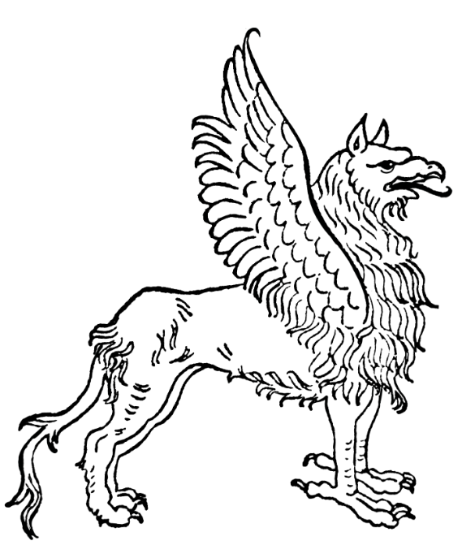

# Тиждень 1: Концепт
>Формулюйте великі ідеї і збирайте джерела.

"Крок 1 - це те, що ви робите у своїй голові. Тепер, фентезі/мечі та магія не повинні мати ніякої фіксованої основи для припущень, зроблених суддею (мій суддя не має), окрім тих, які охоплюють все фентезі. Цей вид кампанії може змішувати будь-які та всі різні основи, які будуть згадані нижче, а також деякі інші. [...] Сетинги, засновані на обмеженнях (якщо можна говорити про обмеження у фентезі), можуть бути дуже цікавими самі по собі, за умови, що рамки сеттингу дозволять гравцям відносно вільно розгулятися своїй уяві". - EGG

## Основні завдання

- [ ] **Придбайте/створіть блокнот**. Якщо вас лякають красиві щоденники, придбайте звичайний спіральний блокнот або почніть з того, що кілька разів киньте свій шикарний щоденник зі сходів і пролийте на нього каву, щоб він зрозумів, хто в домі господар! Серйозно, візьміть щось, що підходить саме вам: модний чи скромний, новий чи вживаний, дешевий чи дорогий, з малюнками, лініюванням чи чистий. Якщо бажаєте, ви можете працювати в цифровому форматі, звісно, зберігаючи папку з закладками, зберігаючи документи на хмарному сховищі і т.д. 
- [ ] **Підготуйте свою презентацію**. Напишіть 3-7 добре продуманих тез, які будуть одночасно і розповідати, і "продавати" світ вашим гравцям. Кожен пункт має бути лаконічним і цілеспрямованим - кількох чітких речень буде достатньо. Наголошуйте на найбільш важливих моментах, щоб викликати хвилювання, очікування і задати тон. Ваше вступне слово дасть гравцям уявлення про те, що вони можуть очікувати (або не очікувати) у вашому сеттінзі, і допоможе їм створити відповідні концепції персонажів. 
- [ ] **Зберіть свої джерела натхнення**. Перелічіть їх і напишіть одне-два речення, пояснюючи, що кожне з них привносить у сеттінг. Скоротіть список так, щоб у ньому було не більше 7 пунктів. (Це може бути складно, але я вважаю, що важливо сфокусувати ідеї, щоб вас не розкидало в різні боки на початковому етапі). Переконайтеся, що джерела якимось чином пов'язані з вашими пунктами пітчингу. Джерела призначені для вас; ви не повинні ділитися ними з гравцями, а гравці не повинні бути з ними знайомі. Насправді, Гігакс сказав би вам не ділитися ними, оскільки вони можуть зіпсувати деякі сюрпризи для гравців, або ж гравці можуть очікувати, що ви будете використовувати ті частини джерел, які ви не збираєтеся використовувати. 
## Додаткове завдання

- [ ] Створіть дошку настрою. Ви можете скористатися онлайн-ресурсом на кшталт Pinterest або створити олдскульний колаж із зображень, які допоможуть вам налаштуватися на потрібний лад. Дошка настрою - чудовий ресурс для швидкого введення гравців у тон вашого сеттінгу, і вона може стати "живим документом", над яким ви будете працювати з часом, можливо, разом, розширюючи його в міру розвитку сеттінгу. Почніть з десятка-двох візуальних посилань на місця, персонажів, художні стилі тощо. Під час роботи думайте про те, як ви вирішили, що підходить, а що ні. Переконайтеся, що елементи мудборду підтримують або доповнюють ваші основні пункти. 
- [ ] Попрактикуйтесь у подачі ідеї! Спробуйте пояснити свою ідею вголос - спочатку собі, а потім друзям-геймерам (хоча, можливо, не тим, з якими ви поки що збираєтеся грати).

## Приклад

### Узрак, де ходять боги

Всі приклади в цій книзі будуть зосереджені на світі Узрак, світі кампанії, який я створюю для "ретро-клону" Oe D&D Delving Deeper Саймона Булла. Ви можете придбати її в м'якій обкладинці за $4.95 (наразі) на LuLu.com або завантажити безкоштовно на ImmersiveInk.com. Сказавши це, сеттинг в значній мірі агностичний до правил.

### Пітч

- Персонажі гри - люди. Істоти, які більше або менше схожі на людей, походять від взаємодії богів і смертних або з більш давніх часів. Цих істот бояться і не довіряють, навіть якщо деякі з них стали людьми (наприклад, кентаври).
- Залізні інструменти є відносно новими і протиставляються магії. Більшість зброї, обладунків, інструментів тощо зроблені з бронзи. Ті, хто практикує магію - і істоти, наповнені магією - погано реагують на контакт із залізом (пухирі та опіки або й гірше). Його носіння заважає магічним здібностям. Залізна зброя має +1 до удару і шкоди проти магічних істот, але не може бути зачарована. Персонажі, які не практикують магію, можуть використовувати магічні предмети, але ризикують отримати зворотну реакцію, якщо носитимуть чи носитимуть багато заліза. 
- Існує лише два класи: маги та бійці. Персонажі можуть бути подвійного класу, але навіть один рівень мага означає отримання слабкості до заліза. Маги грають зі здібностями, не призначеними для використання простими смертними. Спочатку більшість магів використовують менші сили для свого чаклунства, але щоб отримати справжню силу, багато магів присвячують себе божеству-покровителю або просто поневолюють його. (Заклинання кліриків відкриті для магів).
- Сили Хаосу і Закону воюють за долю людства. Люди розглядаються як загроза через їхнє розмноження, інновації та вроджену впевненість у власних силах. Боги намагаються підірвати, завербувати або знищити людей, розглядаючи їх як фігури в якійсь складній і смертельно небезпечній грі. Свытогляд має значення!
### Джерела натхнення

- Обкладинки книг Джека Гогана. Використовуються для натхнення персонажами, істотами, расами та загальним дивацтвом/стилем. Також використання яскравих кольорів, службових значків і т.д. буде важливим для демонстрації прихильності. Моя [дошка настрою](https://www.pinterest.com/rayotus/kuulshiz/uzerak-where-gods-walk/).
- Культурний атлас Месопотамії та Стародавнього Близького Сходу Майкла Роафа. Месопотамія раннього залізного віку - це те, звідки я в першу чергу буду черпати інформацію про технології, архітектуру та міфологію. Підійде практично будь-яка книга з ілюстраціями про шумерів, ассирійців, вавилонян, аккадців тощо. Щодо інших культур, я звернуся до стародавніх Індії та Єгипту, а також до скандинавських матеріалів. Однак місце дії не є історичним. Відпиляйте серійні номери! 
- Список месопотамських божеств з [Вікіпедії](https:// en.wikipedia.org/wiki/List_of_Mesopotamian_deities). Навіщо ускладнювати собі життя? У цій кролячій норі більше богів і міфів, ніж я міг би прочитати за все життя, особливо якщо перейти за посиланнями на пантеони сусідніх культур. 
- "Пастельне місто" М. Джона Гаррісона. Мені подобається, як у цій книзі пейзаж розглядається як персонаж. Світ занурений у майже плідний вид занепаду і завалений залишками попередньої цивілізації. [Ця рецензія](https://sciencefictionruminations.com/2016/11/21/book-review-the-pastel-city-m-john-harrison-1971/) передає настрій. Див. також "Zothique" К. А. Сміта.
- Некроскоп III: Джерело" Брайана Ламлі. Лорди-вампіри, їхні створіння з фігурної плоті та їхні очі взяті з цієї серії. У Deadspawn вони отримали ще більший розвиток. 
- "Розваги арабських ночей" Луїса Рхеда, озвучені Чарльтоном Гріфіном. Я хотів, щоб аудіокнига була в моєму списку натхнення, щоб накопичувати ідеї під час прогулянки з собакою або по дорозі на роботу. 
- ""Dungeon Crawl Classics" Джозефа Гудмена. Звідси я черпаю ідеї про хаотичні вітри магії, магічне псування та божеств-покровителів.

### [Далі](Тиждень%202%20Околиці.md)