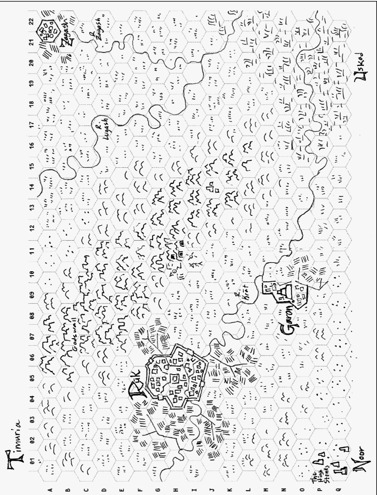
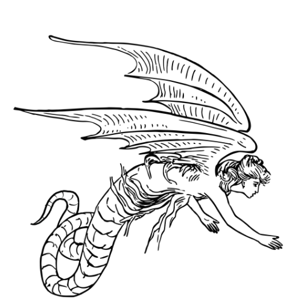

# Тиждень 2: Околиці
>Нанесіть на карту землі навколо підземелля і міста.

Гігакс пропонує "сісти з великим аркушем паперу з гексагональною лінійкою і намалювати карту великого масштабу. Мапа з масштабом 1 гекс = 1 миля (1.6 кілометра) ... буде приблизно правильною для таких операцій гравців, як дослідження, кемпінг, пригоди і, врешті-решт, будівництво своїх фортець. Навіть такі дрібниці, як хатина відьми і бічні входи в підземелля, можуть бути показані на карті. Центральними об'єктами мапи мають бути головне місто та вхід до підземелля". - EGG 
## Завдання

- [ ] **Візьміть аркуш з гексагональною сіткою**. Намалюйте на ньому наступні предмети. Назвіть все, що заслуговує на назву. Якщо вам незручно малювати, існує безліч програм для малювання на гексагональному папері! Мені подобається Hex Kit від Negative Cone of Energy. 
- [ ] **Одне велике поселення** (визначте розмір як вам подобається) 
- [ ] **Два інших поселення** (табори, більші або менші міста, фортеця, батьківщина фентезійної раси і т.д.) 
- [ ] **Одна головна особливість місцевості** (що охоплює щонайменше три гекси) 
- [ ] **Одне таємниче місце для дослідження** 
- [ ] **Один вхід до підземелля** - як мінімум! 
- [ ] **Зробіть ключ до карти**. Найпростіший спосіб зробити це - пронумерувати рядки гексів і позначити буквами стовпчики. Це дасть вам координати, на які можна посилатися. Запишіть назви місць і типів місцевості, використовуючи ці координати, або напишіть їх безпосередньо на карті.

## Щодо масштабу
Якщо ваш гекс-папір містить 23x14 гексів, то в масштабі 1 миля (1.6 кілометр) до 1 гекса буде відображати площу, що дорівнює 322 милям² - приблизно половина розміру великого Лондона. Масштаб 1:6 представляє 12 432 миль² - приблизно третину площі Ірландії. У вас може виникнути спокуса "розмахнутися", але мета полягає в тому, щоб визначити одну територію, на якій персонажі можуть шукати пригод. Вам не потрібно наносити на карту весь світ. Масштаби, більші за 6 миль на гекс, слід відкинути. На 5-му тижні буде час намалювати карту більшого масштабу. Багато чого можна зробити, маючи лише [кілька гексів](https://chgowiz-games.blogspot.com/2017/11/just-three-hexes-campaign-starters.html)!

## Додаткові завдання

- [ ] **Розмалюйте свою мапу.** Просочіть її кавою, трохи обпаліть краї або додайте трохи кольору. Це зробить вашу карту схожою на справжній документ і/або додасть їй присутності за столом. 
- [ ] **Створіть таблицю випадкових зустрічей**. Зробіть таблицю 2к6 (11 слотів, пронумерованих 2-12). Помістіть найменш небезпечні/найпоширеніші зустрічі в середину таблиці, а найрідкісніші - вгорі і внизу списку. Подумайте про те, щоб зробити кілька зустрічей з цікавими NPC. Я також пропоную включити пригодницькі гачки, на кшталт "2к4 гобліни грабують труп мертвого дворянина" замість того, щоб просто писати "2к4 гобліни".

## Приклад

### Шестигранна карта Тимурії
 Після того, як я намалював цей ескіз Тимурії, регіону Узрак, я зрозумів, що він має дивний масштаб. Я почав з міст і масштабу 1 миля на гекс в моїй голові. Коли я малював пустелю, я мимоволі змістив масштаб і мислив гексагонами в 3 або навіть 6 миль. В результаті карта має такий собі примітивний картографічний масштаб, де більш важливі речі більші. Ось так помилки стають крутими фішками!

## Таблиця випадкових зустрічей

| 2к6 | Істота, гак.           | Пригодницькі гачки                                                                                                                                                          |
| --- | ---------------------- | --------------------------------------------------------------------------------------------------------------------------------------------------------------------------- |
| 2   | Сфінкс, Аватар Порядку | Аватар кидає виклик гравцям за допомогою логіки (у формі загадки) і накидається на тих, хто не може відповісти; припускаючи, що їхній розум затьмарений Хаосом.             |
| 3   | Мантикора              | Скажена мантикора втратила здоровий глузд. Вона блукає рівнинами, зі злості вбиваючи все, що зустрічає.                                                                     |
| 4   | Кентаври               | Стадо кентаврів к6+1 полює на втікача: людину, яка зіпсувала тотемний стовп їхнього племені.                                                                                |
| 5   | Патруль                | Патруль з к6+2 вартових з сусіднього міста зупиняє вас і розпитує про одноокого чоловіка в багряних обладунках.                                                             |
| 6   | Караван                | Рівниною тягнеться верениця возів к6, кожен з яких має водія, 2 охоронців і к3 мешканців. Вони відчайдушно намагаються знайти джерело води.                                 |
| 7   | Бандити                | 2к6 головорізів верхи на сокиродзьобах (Axe beak) переслідують вас, сподіваючись, що у вас є залізна зброя або якісь речі, які можна вкрасти. Вони будуть задоволені вашою монетою.          |
| 8   | Пожирачі плоті         | Наближається брудна шайка к6+4 пожирачів плоті, які хочуть обміняти цікаві реліквії, знайдені ними в печерах Божого валу. Вони жадібно поглядають на всіх хворих і слабких. |
| 9   | Лицар Хаосу            | Лицар хаосу (вкритий шипастими обладунками) прагне вразити свого бога і викликає на поєдинок найсильнішого представника закону серед учасників партії.                      |
| 10  | Змієборці              | "Повзучий" загін змієборців (к6+1), рухаючись під покровом темряви, везе зашифроване послання до культиста в Гароні.                                                        |
| 11  | Гарпії                 | Зграя гарпій (к3 + розмір партії) атакує табір двома хвилями, відволікаючи охоронців, а потім крадучи всі блискучі предмети, до яких можуть дістатися їхні кігті!           |
| 12  | Володар вампірів       | Вампір верхи на літаючому жаху (Flying Horror) з понівеченої плоті помітив вас. Які шанси, що він повернеться вночі або коли ви ослабнете?                                                  |

### [Далі](Тиждень%203%20Підземелля.md)