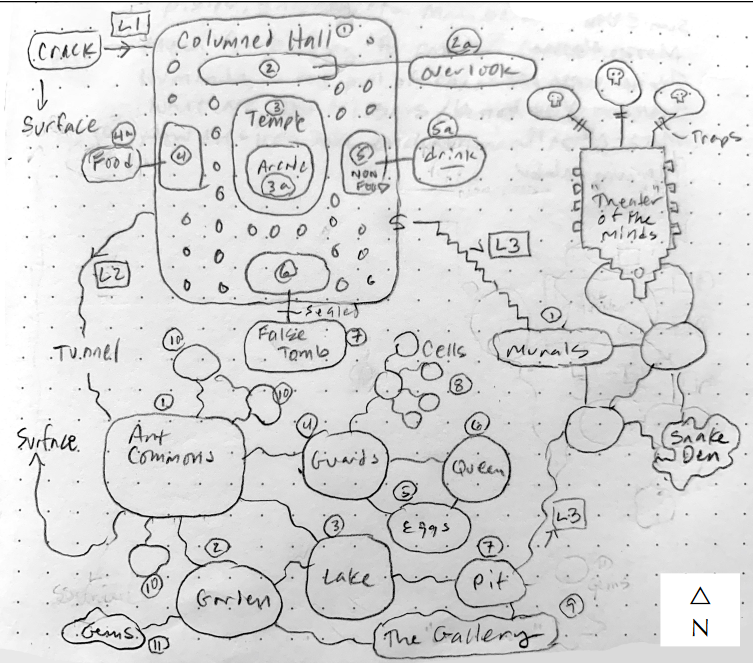

# Тиждень 3: Підземелля
> Намалюйте три рівні вашого підземелля.

"Крок 3 [...] дуже складний і трудомісткий. Кожен рівень повинен мати центральну тему і якусь відмінну рису, тобто рівень з великими відкритими просторами, що кишать гоблінами, рівень, де основна схема коридорів, здається, повторюється нескінченно, рівень, населений лише монстрами, що живуть у вогні або використовують вогонь, і т.д. Після проходження кожного рівня різні способи переходу на нижчі рівні повинні бути зашифровані і відзначені на відповідних нижчих рівнях [...] Ретельний план того, які монстри і скарби будуть знайдені на кожному рівні, також дуже необхідний, і його підготовка може зайняти стільки ж часу, скільки і сам рівень". - EGG

## Завдання

- [ ] **Опишіть вхід до підземелля 7-10 словами**. Ви можете багато чого розповісти про місце, дивлячись на його двері. 
- [ ] **Створіть мапу "точка-точка"**. Це проста карта з колами (кімнати, печери тощо), які з'єднані один з одним лініями (проходи, тунелі, зали, сходи, гірки...). Не хвилюйтеся поки що про візуальну складову, ця карта допоможе вам створити гарний вигляд підземелля. Масштаб і деталізацію можна буде додати пізніше. 
- [ ] **Намалюйте три рівні.** Для кожного рівня включіть щонайменше к6+6 кімнат/зон і з'єднайте їх між собою. Переконайтеся, що вони не з'єднані як нитка перлин (всі в одну лінію). Принаймні половина кімнат повинна мати більше одного входу/виходу. Додайте більше кімнат, якщо вони вам потрібні! 
- [ ] **Додайте декілька (скажімо, к3+1) виходів нагору та/або вниз на кожному рівні.** Ці виходи можуть бути подвійними, наприклад, сходи вниз на рівні 1 також є сходами на рівні 2 і/або 3. Пам'ятайте, що це не обов'язково повинні бути сходи: ви можете використовувати гірки, шахти, ліфти, річки тощо. 
- [ ] **Придумайте 1 тему для кожного рівня.** Спробуйте кинути к3+2 для кожної теми, щоб сформувати своєрідний бюджет. Це допоможе вам не забувати посилювати теми кілька разів на кожному рівні. (На відміну від справжнього бюджету, тут можна перевитрачати!) Приклади тем: розкрадачі гробниць, павуки, машини, фонтани і басейни або гриби. У міру того, як ви будете наповнювати підземелля, ви будете витрачати свій бюджет на включення посилань на ваші теми за допомогою орнаментів, істот, сенсорних деталей тощо. Це нормально, якщо тема "перетікає" на рівень вище або нижче.
- [ ] **Складіть список з десятка знакових монстрів і розмістіть їх у кімнатах/зонах.** Ви можете розмістити їх у кімнатах або проходах, причому на будь-якому рівні. Як правило, чим небезпечніша істота, тим нижче вона буде знаходитися. Якщо якийсь із монстрів допомагає реалізувати одну з ваших тем, не забудьте зменшити бюджет відповідним чином. Ваших монстрів також можна розташувати в таблиці блукаючих монстрів 2к6. Помістіть тих, які найчастіше блукають, в середину таблиці.
- [ ] **Розподіліть к6 основних об'єктів по всьому підземеллю.** Об'єкти повинні бути інтерактивними: пастки, головоломки, двері, що розмовляють, чарівні фонтани... Якщо якийсь з них підсилює тему, зменшіть його бюджет. Це унікальні або помітні об'єкти. Заповніть навколо цих елементів загальну "обробку підземелля", якщо це необхідно. Якщо у вас невелика кількість, зробіть кожну особливість по-справжньому вражаючою! 
- [ ] **Для кожної кімнати/зони відмітьте будь-який скарб.** Киньте к6 для кожного з них. Якщо вона містить істоту або особливість, то там є скарб на 1-4. Якщо у вас є таблиці випадкових скарбів, ви можете кинути кожну з цих купок скарбів зараз, щоб заощадити час пізніше. 
- [ ] **Назвіть три дивовижні предмети і вкажіть, де вони знаходяться в підземеллі.** Візьміть їх з вашого матеріалу або придумайте їх. Знову ж таки, якщо вони підсилюють тему, ви можете зменшити бюджет цієї теми. Ці предмети, ймовірно, є додатковими до всіх чарівних предметів, які випадають як частина розміщених скарбів, якщо тільки ви не випадають дійсно хороші. 
- [ ] **Витратьте решту бюджету на додавання деталей.** Зверніть увагу на незвичні запахи, дивне освітлення, дивну кам'яну кладку, статуї чи інші декоративні елементи, тривожні звуки, повідомлення, написані на стіні, трупи попередніх шукачів пригод... 
## Додаткове завдання

- [ ] **Нанесіть всі три рівні на ватман.** Гігакс сказав би, що це обов'язкова вимога, але в іграх у стилі "театр розуму" це може бути необов'язковим. Масштаб старої школи для карт - 1:10' (десять футів (3,04 метра) у квадраті), що дозволить вам розмістити набагато більше підземель на сторінці, але ви можете використовувати 1:5', якщо хочете, або якщо ви плануєте грати в більш тактичну гру. Якщо ви не наносите його на ватман, зробіть позначки на бульбашках і лініях про висоту стелі, довжину коридорів, розміри і форми кімнат тощо. Цього достатньо для хорошого опису.

## Приклад

### Загублений храм древніх
- **Вхід**: Тріщина в масивному валуні, звідки дме смердючий вітерець. 
- **Кімнати** (виходи) за рівнями: 9 (4), 12 (2), 8 (2).
- **Тематика** (бюджет): Очі (4), Гриби (5), Забуте (3). 
- **Монстри**: гарпії охороняють вхід. На першому рівні переслідує жива статуя. Другий рівень - колонія гігантських мурах. Деякі з них мутували і мають єдине занадто людське око на лобі. У фальшивій гробниці мешкає привид. М'ясоїдні комарі (стиргеси) заполонили грибний сад. В озері живе величезний сом. У тріщинах і під уламками ховаються скорпіони завдовжки у фут. У мурашиній ямі звиває собі гніздо чорна медуза. На третьому рівні живе масивна кобра-альбінос, яка полює на гігантських шиплячих тарганів. 
- 4 **особливості**: крилата статуя в храмі в центрі першого рівня запускає/спрямовує сталкера. Рясний червоний гриб на рівні 2 смачно пахне, а на смак ще смачніший; шкода, що від нього ваш піт привертає до себе нечисть. Заклинання плутанини на 3 рівні змушує непроханих гостей забути, навіщо вони прийшли і як звідси вибратися. "Театр" на 3 рівні, який можна зробити для демонстрації знань древніх. 
- 3 **дивовижні предмети**: гачкуватий скіпетр повелителя змій знаходиться у фальшивій гробниці. Магічне дзеркало/портал знаходиться в печері під поверхнею озера. Червоні самоцвіти пам'яті зберігаються у мурах. 

### Карта підземелля

Зображення нижче - це мапа підземелля, яку я ще не закінчив. Я вирішив залишити деякі прогалини на рівні 3, щоб реагувати на дії персонажів у попередніх сесіях. (Це те, що я сказав собі після того, як не виконав всі завдання на тиждень). Нижче наведені приблизні нотатки для кожного рівня. Вони повинні дати вам уявлення про загальний план і відчуття підземелля. Зірочки вказують, коли витрачається бюджет теми, тобто "грибний сад*" означає, що я витратив 1 бал на тему "Гриби".

**Рівень 1**. Цей зал-гіпостиль висічений з живої скелі. Тріщина в північно-західному куті веде на поверхню. Потаємні односторонні двері у східній стіні відкриваються на вузькі сходи, що ведуть до рівня 3. Гігантські мурахи прорили тунель з рівня 2 біля західної кімнати. У центрі зали знаходиться відкритий храм. У верхній частині зали знаходиться другий поверх з кімнатами по сторонах світу: південна - фальшива гробниця, північна - вартівня, а східна/західна кімнати використовувалися для зберігання. Східну кімнату захопили гігантські мурахи з рівня 2, і вона використовується переважно для зберігання їжі. Порожні вікна цих верхніх кімнат змушують персонажів відчувати, що за ними стежать*. Переслідувач у залі, статуя велетня із зав'язаними очима* та головою слона, кидатиметься на непроханих гостей доти, доки менша багатоока* статуя в центрі храму може їх "бачити". Переслідувач смертельно небезпечний, його майже неможливо вбити, але він дуже повільний. Коли він не рухається, він смертельно тихий; персонажі, які виходять з будівель, можуть отримати сюрприз. Іноді знизу з'являється одноока* мураха-мутант, яка п'яно хитається.

**Рівень 2**. Численні грубо витесані камери цього рівня слугують домівкою для колонії гігантських мурах. Вони зайняті 24/7, працюючи позмінно в нескінченних сутінках, створених всюдисущим червоним грибом, що світиться.* Гриб смачно пахне, але мурахи, здається, ігнорують його. Незвичайні пам'ятки на цьому рівні включають прекрасний сад грибів*, підземне озеро з чорною водою, невелику печеру, наповнену червоними самоцвітами розміром з інжир, і, здавалося б, бездонну яму. Чорний слимак, що живе в ямі, здається, насолоджується червоною пліснявою, прогризаючи її великими шматками і залишаючи після себе відкриті сліди на злегка слизькому камені. (Ці смуги мають стати більш помітними для персонажів, коли вони наближатимуться до ями). Спокійна поверхня озера не видає присутності гігантського сома внизу. Він завжди голодний і швидко реагує на будь-яке порушення, сподіваючись, що туди впала велика мураха. Кожен десяток чи два мурах - мутанти. Вони занадто довго перебували під впливом червоних самоцвітів і тепер "прокидаються". Самоцвіти (насправді зморщені мізки химерної, давно вимерлої раси) були підняті з рівня 3 і зібрані мурахами. Довга зала внизу карти - це місце, де збираються мурахи-мутанти. Вони індивідуалістичні, ліниві і майже весь час під кайфом. Зазвичай мурахи відчувають через запах, але ці мурахи малюють на стіні розмазаним грибком*, видають дивну клацаючу "музику" і загалом добре проводять час.  Однак вони можуть бути небезпечно незграбними у своєму дурнуватому стані, і час від часу між ними та незадоволеними воїнами колонії, які не хочуть втрачати більше громадян через це несподіване божевілля, спалахує насильство. Тунель на глибині 20 футів під поверхнею ями веде на рівень 3

**Рівень 3**. Цей рівень - більше, ніж гробниця, це архів знань. Кожні "двері" не мають ручки, запечатані восковою речовиною, і їх треба відчиняти силою. Перше, досить велике приміщення - це зал фресок, на яких зображено життя стародавньої раси змієподібних гуманоїдів. Мабуть, вони жили вздовж родючої річки. Розписи дивним чином впливають на почуття персонажів, здавалося б, випромінюючи тонке дзижчання комах, подих теплого вітерця або навіть запах солонуватої річкової води. Кожен персонаж відчуває щось своє. Ефект схожий на снодійну плутанину.* За межами головної галереї є кілька кімнат, наповнених артефактами з повсякденного життя зміїного народу. Стіни цих кімнат подекуди пронизані тунелями, які, схоже, з'явилися вже після того, як їх запечатали. Тунелі нерівні і мають близько 3 футів у діаметрі. Якщо персонаж заповзе в них, він знайде величезні скинуті зміїні шкури та/або зіткнеться з велетенською коброю-альбіносом. У грубому гнізді кобри в кінці тунелів лежить кладка забутих* яєць, які охололи і, здається, ніколи не вилупляться.

Остання кімната - Театр розуму. Його арочні стіни пронизані незліченними нішами, в кожній з яких зберігається дивний череп. Кожен череп, якщо його дослідити, виявиться з унікальним візерунком дивних завихрень на внутрішній поверхні, що нагадує дивні шорсткі візерунки на червоних самоцвітах. Дійсно, після невеликого тестування та процесу виключення, персонажі можуть знайти один-два збіги. (Якщо ні, персонажі можуть виявити кілька червоних камінців, які все ще знаходяться всередині їхніх черепів у найвищих нішах). П'єдестал посеред кімнати активує театр, якщо на нього покласти камінь (всередині відповідного черепа). П'єдестал змусить самоцвіт проектувати сцени (очима черепа), взяті зі спогадів істоти. Видіння стосуються давно забутого* способу життя зміїного народу. Видіння можуть включати туманні та швидкоплинні проблиски стародавніх таємниць, казкових скарбів, важливих історичних подій та/або дивних винаходів, які світ втратив. Зали-пастки ведуть до місця останнього спочинку трьох дуже важливих королев-сестер. Їхні неушкоджені черепи/самоцвіти неодмінно стануть цінною знахідкою, якщо героям вдасться їх безпечно винести. Пастки залів - це великі кам'яні брили, які впадуть і, ймовірно, розчавлять будь-кого, хто порушить таємницю цих священних місць спочинку. Кобра-альбінос належала одній з королев; вона була її знайомою. Вона подарувала їй довге життя за допомогою чаклунства, і якщо її древній розум прокинеться, вона покличе його до себе. Спершу вона накаже йому напасти на грабіжників гробниць. Потім вона спробує перенести свою свідомість у свого прекрасного домашнього улюбленця.

### [Далі](Тиждень%204%20Особливості%20міста.md)