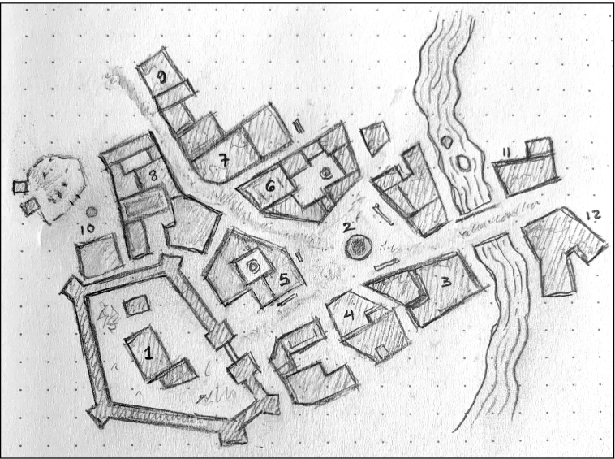
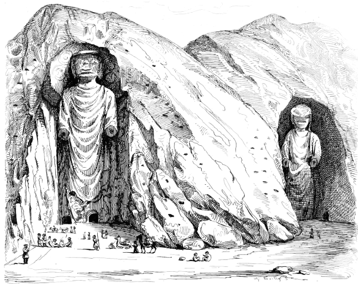

# Тиждень 4: Особливості міста
> Деталізуйте містечко, де персонажі усамітнюються, щоб зцілитися і розважитися.

"Тут ваші гравці знайдуть житло, купуватимуть спорядження, набиратимуть найманців, шукатимуть допомоги у магів та кліриків, питимуть, гратимуть в азартні ігри та розпустуватимуть. [...] Чудернацькі вежі, злодійський квартал і храми жахливих божеств додають грі ще більшого колориту. "" Гільдія крадіїв "", товариство злих кліриків, братство законників і т.д. також приносять трохи більше інтересу. Якщо кілька войовничих дворян з навколишніх територій також посилають сюди великі загони людей, іноді можуть відбуватися цікаві бійки. Слід вказати чесних і нечесних торговців, таверни, в яких продають наркотики, і так далі. У будь-якому випадку не забудьте залишити місце для додаткових речей і розширення". - EGG
## Завдання

- [ ] **Знайдіть або намалюйте карту міста.** Тут не потрібно багато балів за оригінальність. Знайти стару карту міста або генератор міст в Інтернеті і вставити її копію у свій щоденник - це розумний хід. На наступних етапах ви все одно зробите її своєю власною. 
- [ ] **Подивіться на список спорядження для вашої гри.** Назвіть кілька крамниць, де можна купити різні предмети: кузня для зброї та обладунків, стайня для коней тощо. На цьому етапі вам може знадобитися генератор фантазійних назв або список. Якщо ви сумніваєтеся, назвіть місце на честь власника, наприклад, "Шкіряна крамниця Тарна". 
- [ ] **Знайдіть/опишіть принаймні п'ять з наведених нижче об'єктів коротким реченням:** 
	- Політичну фракцію та її суперника 
	- Місце, де персонажі можуть втратити всі свої гроші 
	- Місце, де люди збираються, щоб почути новини або висловити свої думки 
	- Таємний зал гільдії та її репутація 
	- Відмінне місце, де можна отримати гарячу їжу і чисте ліжко (або паршиву їжу і піддон, що кишить блохами) 
	- Релігійний центр і бог(и), якому він присвячений 
	- Унікальна для цього міста особливість (вид на природне диво, дивний годинник, цілюще джерело тощо).

- [ ] **Створіть щонайменше 5 НІПів, кожен з яких має "ДНК" (DNA).** D (Distinguishing) - це відмінна риса . N (Need) - це те, чого вони потребують найбільше. A (Agenda) - це їхні плани, таємні чи ні; що вони сподіваються зробити в найближчі дні, тижні, місяці чи навіть роки? (Як варіант, А може означати Актив (Asset), який є у гравців і який їм потрібен).
## Додаткові завдання
- [ ] **Створіть 4-5 найманців або спеціалістів.** Це персонажі, яких гравці можуть завербувати, або НІПи, які можуть спробувати завербувати персонажів. 
- [ ] **Згенеруйте 7-9 чуток, які ходять містом.** Більшість з них мають бути не пов'язані між собою, принаймні на перший погляд. Деякі з них повинні бути абсолютною нісенітницею. 
- [ ] **Опишіть все!** Знайдіть час, щоб написати кілька речень про кожну споруду.

## Приклад

### Місто Аддак

**Аддак** - прикордонне містечко з населенням близько 600 осіб, розташоване між Руком і Стіною Бога, де нещодавно було виявлено кілька гробниць. Більшість невисоких будівель з сирцевої цегли та кам'яних блоків були зведені за останні десять років. У південно-західному куті міста стоїть невеликий форт з 12-футовими (3,65 метра) стінами з обробленого каменю. Солдати всередині - єдина форма закону на багато миль навколо, і вони здебільшого ігнорують все, що відбувається поза стінами форту. Рада купців та їхні головорізи досягли делікатного балансу, який тримається, коли часи процвітають, і розпадається, коли ситуація стає відчайдушною. Основна торгівля в місті - це екіпірування шукачів пригод, які прямують до гробниць, купівля речей, які вони привозять, і допомога їм витрачати новознайдені монети. 
1. **Форт і казарми**. Солдати у форті слідують за Зуулом, генералом Рука. Зуул змушений розмістити більшу частину своїх військ у місцях, розкиданих далеко за межами міста, через побоювання короля бути поваленим. Тарак, капітан гвардії Аддака, зрештою контролює місто. Він дозволяє більшості речей йти своїм чередом, але вдається до швидких і рішучих дій, якщо виникає бунт, пожежа або інша загроза самому місту. Тарак дуже сутулий і носить вічно насуплений вигляд. Він відчайдушно потребує новобранців і зрештою сподівається вигнати кентаврів з цієї місцевості. Солдати Тарака знають про його одержимість кентаврами і шепочуться, що він має коваля Гралка, який працює над секретною зброєю. 
2. **"Площа"**. Цей приблизно прямокутний клаптик бруду, що оточує великий загальний колодязь, нічим не примітний, але жвавий. Якщо в місті щось відбувається, це часто починається або закінчується тут. Новини швидко поширюються на площі, і агітатори іноді використовують її для виступів. Міський провісник, Кезрік, має одне помутніле око і докладає всіх зусиль, щоб переконати всіх, що кінець світу настане на 13-му молодик. 
3. **"Утоплена собака"** та **"Хлібний дім Варни"**. У цій напівзруйнованій будівлі подають жахливий, але дешевий ель. Варна, яка володіє будівлею, має пекарню з одного боку, що більш ніж компенсує кислий смак елю. Вона носить хустку, щоб прикрити своє поріділе волосся, любить таємниці, але не вміє їх зберігати. Вона чула, що колонія гарпій на сході захопила в полон принцесу Загаш. 
4. **Tarkeen's Dry Goods.** Тут можна придбати більшість основних товарів, необхідних мандрівникам: шкіряні речі, дорожні пайки, ковдри, ліхтарі, мотузки, кирки тощо. На складі за крамницею Таркін влаштовує азартні ігри з високими ставками лише за запрошеннями. У нього сіпається обличчя, що дуже відволікає і трохи лякає. Йому завжди потрібно більше золота, бо він хоче викупити всі будівлі на площі. Його пропозиції іншим власникам стають все більш "агресивними". Ходять чутки, що за Таркіном стоїть таємнича організація з Гарона. 
5. **Гніздо Гарпії.** Популярна таверна, і досить цивілізована, якщо не сказати, що особливо чиста. Її часто відвідують солдати з форту. Власник, Ганек, пропонує пристойну їжу і нічліг, але вимагає з мандрівників високі ціни, бо може. Він не потерпить ніякого дебошу - якщо тільки солдати самі його не влаштують (в такому випадку він мало що може зробити). Ганек перебуває на службі у короля Фарзанока і стежить за Тараком та його солдатами на предмет будь-якої бунтівної активності. У нього завжди в руці мокра ганчірка, якою він безперервно витирає все, що потрапляє під руку. Він сподівається, що незабаром станеться щось варте уваги, бо шпигун, якого Фарзанок щотижня посилає за новинами, починає підозрювати самого Ганека. 
6. **Хунзу**, постачальник шкіряних виробів на замовлення. Шкіряні вироби Хунзу добре відомі. Чому він вважає за краще жити в цьому прикордонному містечку, а не у великому місті, ніхто не здогадується. Багаті купці з Рук, Гарона та інших міст регулярно приїжджають сюди, щоб придбати вироби Хунзу. Хунзу також утримує невелику шкіряну майстерню нижче за течією, якою керує його сестра Харта. Подейкують, що сила Хунзу походить від його зв'язку з аватаром Хаосу. Дехто навіть стверджує, що він відростив хвіст, який ховає у вільних штанях, які носить. 
7. **Кузня Гралка**. Гралк спеціалізується на знаряддях насильства. Він досить зайнятий, і замовлення зазвичай доводиться чекати тиждень або більше, якщо тільки вони не приходять з додатковим мішком монет. 
8. **Будівельник Утару.** Утару та його команда (більшість з них - його велика родина) відповідають за багато споруд у місті. Таркін, якого нещодавно пограбували, звинуватив Утару в пособництві злодіям, які вдерлися на його склад, бо ті скористалися старим димарем, який був заблокований. Таркін вважає, що тільки Утару міг знати про це. 
9. **Трави Анани**. Анана - аптекарка з посереднім талантом. Вона робить все можливе, щоб забезпечити місто припарками, цілющими травами та іншими ліками. Вона добре заплатить за певні трави з кривавих боліт навколо Ускаду. Ананса явно пообіцяла собі владу. Її очі мають вертикальні прорізи для зіниць і моторошно світяться при слабкому освітленні. Вона жадає увійти в наступне коло влади в своєму культі і таємно працює над цим. Незважаючи на це, вона здається досить нешкідливою і готовою допомогти кожному, хто попросить. 
10. **Прекрасні коні Нінгари**. Між шукачами пригод, які вирушають до гробниць (які часто не повертаються) і постійно присутніми солдатами, в Нінгарі процвітає торгівля сокиродзьобами і витривалими, але повільними гігантськими їздовими ящірками, яких полюбляють пустельні кочівники. 
11. **Дивацтва Ардона**. Ардон Доторіс - блідий чужинець із Загашу. Його б не терпіли недовірливі городяни, якби він не мав таких цікавих речей на продаж. Ардон платить великі гроші за речі, пограбовані з гробниць, і наймає кілька охоронців, щоб зберегти свій скарб у безпеці. Подейкують, що у нього є таємна скарбниця, захована в пустелі. Час від часу він зникає на кілька днів і часто повертається з новими речами на продаж. 
12. **Храм пастуха**. Хоча номінально храм присвячений Думузіду, тут є статуї багатьох богів, включаючи його дружину Інанну та її старшу крилату сестру Ерешкігаль. Насправді тут є 12 кам'яних статуй, кожна з яких близько 7 футів заввишки. Скульптура досить груба, і храм був би зовсім не вражаючим, якби не був розташований у такому маленькому містечку. Жриця Дару та її 5 помічників доглядають за будівлею і виконують необхідні обряди. Зверніть увагу, що в текст вище вплетено ДНК НІПів і чутки з додаткових завдань.

### Найманці+

Оскільки статистика найманців значною мірою є питанням системи, я не буду вдаватися до конкретики. Але ось кілька ідей щодо їхнього "ДНК". Також деякі з них не зовсім найманці, а скоріше можливі покровителі. Моя помилка. 
- **Сака**, Другий з Дванадцяти. Присадкуватий, бородавчастий людина-провідник з носом, що відчуває воду. Його незвична манера говорити полягає в тому, що він час від часу повторює останнє слово в реченнях. Час від часу. Він не буде битися, якщо не буде вибору; вважає за краще використовувати хитрість, щоб врятувати свою шкуру. Йому потрібне золото, щоб утримувати овдовілу сестру, і він хотів би видати її заміж, щоб її доля більше не була його головною турботою. 
- **Ілла**. Відмінна вершниця і вільна духом, Ілла хоче вибратися з Аккада і візьметься майже за будь-яку роботу, яка допоможе їй це зробити. Вона добре поводиться з тваринами і знає багато про історію та народи, що живуть у цій місцевості, хоча й не дуже багато подорожувала. У неї яскраво виражені очні зуби, але якщо ви пожартуєте про її "ікла", то пошкодуєте. 
- **Дар Мокз.** Похмурий чаклун з поганою репутацією, який хоче потрапити в гробниці, але боїться зробити це самостійно. Він шукає собі в компаньйони дужих шукачів пригод. Він жадібний до будь-яких предметів справжньої магії і майже напевно незабаром потрапить під вплив тієї чи іншої надприродної сили. Він хоче слави і потужної магії; що він буде робити з нею, якщо отримає її, можна тільки здогадуватися. Нічого доброго. 
- **Лескан** Долмар. Лескан - перспективний юнак, який виріс на одному з суден королівського каналу - займався ремонтом, грузив вантажі та готував їжу. Він прагне більш захоплюючого життя. Він виконуватиме свою роботу із завзяттям, якщо всі інші будуть робити те ж саме. Але найбільше він хоче, щоб до нього ставилися як до рівного.
- **Селка**. Ця вродлива, але сильно пошрамована жінка прожила важке життя в Аддаку. Вона та її чоловік, якого кілька років тому вбили бандити, працювали, перевозячи залізну руду з Божих стін до Руку. Її заощадження майже закінчилися, але Таркін винен їй велику суму грошей, і він намагається відмазатися від боргу, бо це борг її чоловікові, а не їй. Їй потрібна допомога, щоб "переконати" Таркіна віддати борг! Якщо вона отримає допомогу, то, можливо, її переконають віддячити і допомогти її новим знайомим. Зрештою, вона хотіла б заснувати ранчо на півночі і насолоджуватися тишею і спокоєм далеко від політики і смороду Аддака. 
- **Інкаш Фадіма Таргу**. Цей гарно вдягнений молодий джентльмен завжди в пошуках нової справи. Він вважає себе великим мислителем зі срібним язиком. Його гордість легко зачепити, але замість того, щоб замикатися в собі, він стає тихим і планує, як помститися кожному, хто його образить. Він намагатиметься швидко подружитися з будь-яким новачком, беручи його за руку і тягнучи до "Гнізда Гарпії" на випивку або пригощаючи ласим шматком з "Дому Хліба". Однак часто він з дурості забуває вдома свій мішечок з монетами. Інкаш потребує захисту. Він винен Таркіну борг, який не може сплатити, а головорізи Таркіна незабаром завітають до нього з візитом. Втеча також була б ефективною, хоча й менш бажаною тактикою для Інкаша. Понад усе він хоче бути великою шишкою в Аддаку (чи деінде) і твердо вірить, що колись ним стане. 
- **Мердоз Лиходій.** Цей добрий душею і вірний поплічник обожнює набіги на гробниці і є прохідним крадієм, що знаходить пастки. Біда в тому, що він має репутацію невдахи. Тричі він ходив до гробниць, але повертався звідти сам, єдиний, хто вижив зі своєї ватаги. Він пояснює своє везіння тим, що знав, коли треба тікати. Інші підозрюють його у зраді. Мердосу потрібно перервати свою чорну смугу і врятувати свою репутацію. Він працюватиме безкоштовно, але, зважаючи на чутки, навряд чи герої будуть (чи повинні?) йому довіряти. Не допомагає і те, що він постійно облизується і говорить занадто швидко.

