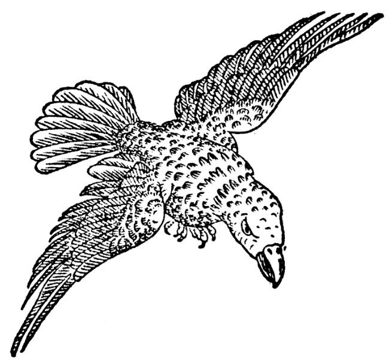

# Тиждень 5: Великий світ
>Доповніть оточення важливими деталями.

"Крок 5 - це ... те, про що вам не доведеться турбуватися відразу; але добре мати загальний план на увазі відразу. Якщо ви плануєте зробити можливим відвідування інших світів, часів або місць, слід також накидати загальну географію "світу", якщо ви плануєте зробити можливим відвідування інших світів, часів або місць, слід також накидати загальний план всіх таких областей. ... більшість відомих мені чудових референтів постійно працюють над своєю кампанією, додаючи, змінюючи та розширюючи різні частини". - EGG
## Завдання

Ви зробили це! На цьому етапі у вас є все необхідне для початку гри. Тиждень 5 (і далі) присвячений розвагам. Цього тижня ви можете робити все, що завгодно, щоб доповнити сеттінг, але постарайтеся виконати принаймні три з наступних завдань. 
- [ ] **Накидайте ескіз географії континенту або навіть цілого світу**. Принаймні, занотуйте приблизне уявлення про те, що лежить на північ, південь, схід і захід від намальованої вами території.
- [ ] **Окресліть інші світи/планети**, які можуть відвідати персонажі, і визначте кілька місць, предметів або заклинань, які перенесуть їх туди. 
- [ ] **Створіть пантеон богів і сил.** Крадіть щедро і уникайте пастки створення богів з гарно вирівняними доменами. Посейдон був богом моря, але також богом коней. 
- [ ] **Створіть неігрових персонажів** і лиходіїв вищого рівня, включно з їхніми ДНК. 
- [ ] **Створіть календар з фестивалями** та іншими важливими датами. Згенерувати деякі події та чутки з інших земель, які можуть почути персонажі. 
- [ ] **Створіть найбільші магічні реліквії світу** та коротку історію для кожної з них: де їх бачили востаннє і хто/що ними володіє. 
- [ ] **Складіть таблиці зустрічей для кожної з місцевостей**, присутніх на вашій карті гекса або в прилеглих землях. 
- [ ] **Створіть конкуруючу компанію шукачів пригод** або найманців, які будуть перетинатися з персонажами гравця!
- [ ] **Нанесіть на карту незвичайні об'єкти**: долину гарячих джерел, вивітрені шпилі, схожі на велетнів, гнійне болото. Ставтеся до кожного місця як до персонажа з ДНК. Д: що унікального в їхньому зовнішньому вигляді? Н: що є дефіцитним; чого найбільше потребують люди, які там живуть або відвідують? К: чого "хоче" саме місце і/або як воно себе поводить? Наприклад: Криваве болото наповнене запашними, липкими червоними квітами. Відвідувачі повинні взяти з собою чисту воду та засоби від комах. Болото хоче проковтнути непроханих гостей і час від часу відригує шкідливі речі з минулого. 
- [ ] **Складіть список системних налаштувань** або домашніх правил, яких потребують ваші умови.
## Додаткові завдання

А що далі? Гра, звісно. Зрештою, в цьому і був весь сенс. Покладіть на стіл і дозвольте гравцям доповнити світ. Коли вони будуть міркувати або мріяти, запишіть те, що вам подобається, і зробіть це частиною декорацій. Забудьте про те, що не працює! Викресліть це; цього ніколи не було. Перетворіть свій щоденник на біблію кампанії, артефакт, який ви з любов'ю створюєте, щоб поділитися ним зі своїми гравцями, а може й з іншими! 
Я б із задоволенням послухав про ваш світ, а ще краще - побачив би кілька фотографій сторінок вашого щоденника! Я також зацікавлений у ваших відгуках. Якщо у вас є пропозиції, виправлення чи покращення, передайте їх мені. 

Якщо ви хочете поділитися, зв'яжіться зі мною за адресою rayotus@gmail.com.

